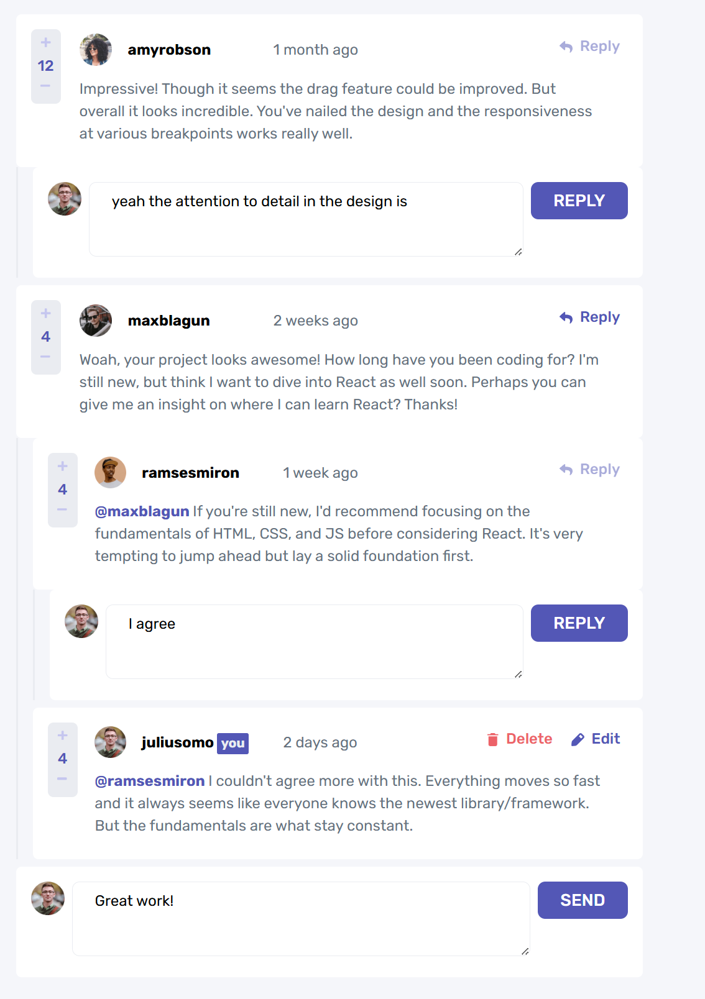

# Frontend Mentor - Interactive comments section solution

This is a solution to the [Interactive comments section challenge on Frontend Mentor](https://www.frontendmentor.io/challenges/interactive-comments-section-iG1RugEG9). Frontend Mentor challenges help you improve your coding skills by building realistic projects.

## Table of contents

- [Overview](#overview)
  - [The challenge](#the-challenge)
  - [Screenshot](#screenshot)
  - [Links](#links)
- [My process](#my-process)
  - [Built with](#built-with)
  - [What I learned](#what-i-learned)
  - [Useful resources](#useful-resources)

## Overview

### The challenge

Users should be able to:

- View the optimal layout for the app depending on their device's screen size
- See hover states for all interactive elements on the page
- Create, Read, Update, and Delete comments and replies
- Upvote and downvote comments
- **Bonus**: If you're building a purely front-end project, use `localStorage` to save the current state in the browser that persists when the browser is refreshed.
- **Bonus**: Instead of using the `createdAt` strings from the `data.json` file, try using timestamps and dynamically track the time since the comment or reply was posted.

### Screenshot



### Links

- Solution URL: [Add solution URL here](https://github.com/annolangen/fem-comments.git)
- Live Site URL: [Add live site URL here](https://annolangen.github.io/fem-comments/)

## My process

### Built with

- Mobile-first workflow
- [Lit-html](https://lit.dev/docs/libraries/standalone-templates/) - For rendering
- [Tailwind CSS](https://tailwindcss.com/) - For utility-first CSS styling
- [Parcel](https://parceljs.org/) - For development and bundling
- [TypeScript](https://www.typescriptlang.org/) - For type safety

I am happy with the tools and their restricted use for the scale of project that is typical for Frontend Mentor challenges. They have all been single page apps with minimal routing complexity.

- Parcel has excellent defaults for TypeScript, good support for Tailwind CSS, and potentially useful asset handling. For Frontend Mentor challenges, asset handling gets in the way, and circumvent it by copying assets into the output directory.
- Lit-html caches the dom and enables a reactive programming style: the rendered HTML is simply a function of state. There is no additional concern with updating component state, or observables, or all that framework stuff. Just keep your wits about you about how much work is performed in the render function.
- Tailwind works well with lit-html because it is just CSS rather than a UI framework with some JavaScript. The combination of lit-html and Tailwind enables a nearly single source style. No navigation between stylesheet and component file - just TypeScript. It is possible to add CSS classes to the stylesheet, and I do define the colors from the style guide there. If I were more willing to jump between index.css and index.ts, I would define the purple button CSS as a class.

### What I learned

Trying to get a specific visual design just right, can be really tedious. The purple badge with the "you" text was particularly challenging for me. What is that padding? How does it interact with line height? How slight is that rounding? This CSS finally looked close enough to me.

```html
<span
  class="text-grey-100 rounded-xs bg-purple-600 px-1 pt-0.5 pb-1 text-sm leading-none font-bold"
>
  you
</span>
```

Accessibility demands significant extra work. After I had completed my visual design and reactions to click events, I got educated about the importance of keyboard navigation and screen reader support. For that I added a form and learned to defeat the default behavior of the submit event. Tracing the buggy behavior of my app to the effect of the form submission took major debuging effort.

I improved my comfort with CSS grids. The comments section layout differs between mobile and desktop views. I was able to use a 12 column grid with media specific starts and spans to rearrange the layout effectively.

### Useful resources

- [Tailwind docs](https://tailwindcss.com/docs/flex) - This searchable, official documentation is precise and concise.
- [Lit-html](https://lit.dev/docs/templates/expressions) - You can get really far with just lit-html's template literals and event expressions. But then some simple things get complicated. For example, the distinction between attributes and properties, and referencing the DOM node for focus or peer input.
